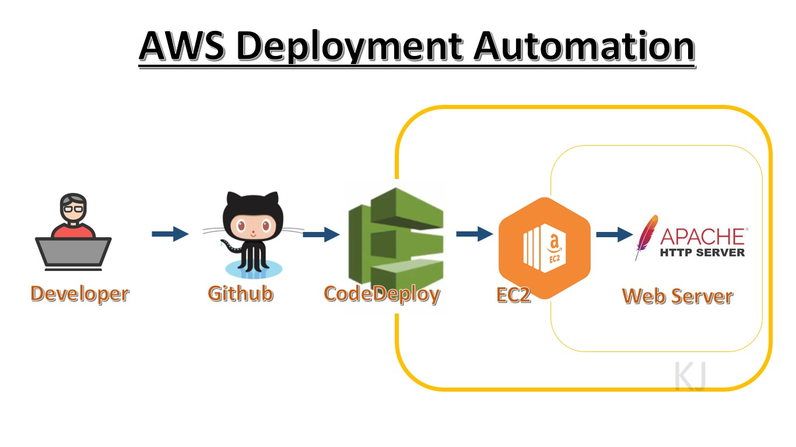

# CodeDeployGitHubDemo 
This is a tutorial how to use AWS CodeDeploy to automate deployment of code from Github to an Apache webserver in an AWS EC2 instance. This is just a one time taking a code from GitHub and deploy to EC2. For next deployment you need to create another deployment at set 


## 1. Setup the required Roles
i. MyCodeDeployServiceRole
   This is the role use by CodeDeploy to do its work
   1. Go to https://console.aws.amazon.com/iam/
   2. Access Management -> Roles -> Create role
   3. Trusted Entity Type = AWS Service , Common Use Cases = EC2, Use Cases For Other AWS Services = CodeDeploy-> Next
   4. Ensure the policy is AWSCodeDeployRole -> Next
   5. Enter Role Name = MyCodeDeployServiceRole -> Create Role

ii. CodeDeployInstanceRole
    This is the role use by EC2 instance to do its work
    1. Access Management -> Policies - > Create Policy
    2. Paste the following json in the json tab
 ```json
 {
    "Version": "2012-10-17",
    "Statement": [
        {
            "Action": [
                "s3:Get*",
                "s3:List*"
            ],
            "Effect": "Allow",
            "Resource": "*"
        }
    ]
} 
 ```
  3. Review Policy, Create Policy, Name = CodeDeployEC2Policy
  4. Access Management -> Roles -> Create role
  5. Trusted Entity Type = AWS Service , Common Use Cases = EC2,
  6. Check the CodeDeployEC2Policy
  7. Name = CodeDeployInstanceRole

## 2. Setup the target( An EC2 with Amazon Linux as OS)
i. Setup EC Instance
1. Goto  https://console.aws.amazon.com/ec2/
2. Launch Instances -> Amazon Linux 2 AMI 64-bit(x86)
3. Ensure Security Group to open port 22, 80
4. Tag name = mycodedeploy

ii. Install the CodeDeploy Agent

```sh
sudo yum update
sudo yum -y install ruby wget
curl -s http://169.254.169.254/latest/meta-data/placement/availability-zone | sed 's/[a-z]$//'
export MYREGION=$(curl -s http://169.254.169.254/latest/meta-data/placement/availability-zone | sed 's/[a-z]$//')
echo $MYREGION
wget https://aws-codedeploy-$MYREGION.s3.$MYREGION.amazonaws.com/latest/install
chmod +x install
sudo ./install auto
```

To Check the Code Deply Agent status
```sh
sudo service codedeploy-agent status
```
You shoud get "The AWS CodeDeploy agent is running as PID <SOME PID Number>. If you get *error: No AWS CodeDeploy agent running*, you may start it manually.
```sh
sudo service codedeploy-agent start
```
If you need to check the Code Deploy agent log
```sh
less /var/log/aws/codedeploy-agent/codedeploy-agent.log
```

## 3. Create Application 
1. Go to https://console.aws.amazon.com/codedeploy
2. Create Application , Application Name = mycodedeploy , Compute Platform = EC2/On Premises
3. Create Deployment Group = mycodedeploy01 , Service Role = < from step #1 >
4. Environment Configuration = Amazon EC2 Instance , Tag Name = mycodedeploy
4. Uncheck Load Balancer
5. Create Deployment Group
   
## 4. Create Deployment
1. Create Deployment
2.
