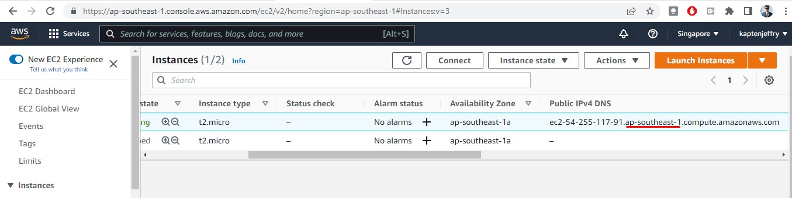

# CodeDeployGitHubDemo
This is a tutorial how to use AWS Code Deploy to deploy code from Github to a Apache webserver in an AWS EC2 instance

## 1. Setup the required Roles
i. CodeDeployServiceRole

ii. CodeDeployInstanceRole


## 2. Setup the target( An EC2 with Amazon Linux as OS)
1. Provision EC2 instance

2. Take note of the region



3. Install Code Deploy Agent prerequisites
```sh
sudo yum update
sudo yum -y install ruby wget
```

5. Set the region. Get from step #2. In this example the region is *ap-southeast-1*
```sh
export MYREGION=ap-southeast-1 
```

6. Download the Code Deploy Agent
```sh
wget https://aws-codedeploy-$REGION.s3.$REGION.amazonaws.com/latest/install
```

7. Install the Code Deploy Agent
```sh
chmod +x install
sudo ./install auto
```

8. Check the Code Deply Agent status
```sh
sudo service codedeploy-agent status
```
You shoud get "The AWS CodeDeploy agent is running as PID <SOME PID Number>. If you get *error: No AWS CodeDeploy agent running*, you may start it manually.
```sh
sudo service codedeploy-agent start
```
If you need to check the Code Deploy agent log
```sh
less /var/log/aws/codedeploy-agent/codedeploy-agent.log
```

